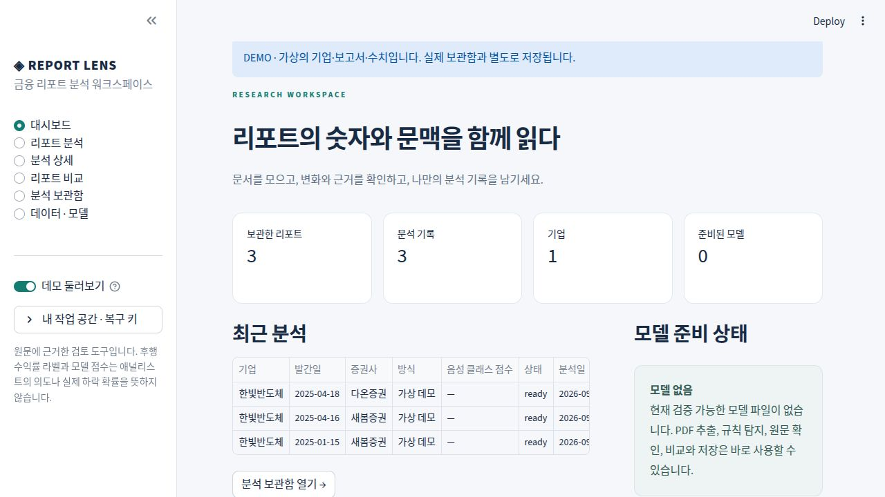

# ◈ Report Lens

**한국어 증권사 리포트를 원문과 함께 읽고, 비교하고, 보관하는 로컬 Streamlit 앱**

[](https://github.com/YangNaang2/AI-Financial-Report-Analyzer/actions/workflows/ci.yml)

기존 AI-Financial-Report-Analyzer를 실제 문서 검토 흐름으로 확장했습니다. 모델이 없어도 텍스트/PDF 추출, 표현 탐지, 원문 확인, 보고서 비교, 보관함과 내보내기를 사용할 수 있습니다. 가상 데모는 실제 기록과 분리됩니다.



> 이 앱의 음성 클래스는 후행 가격 하락으로 만든 대리 라벨입니다. 모델 점수는 애널리스트의 의도, 실제 하락 확률 또는 매수 안전성을 나타내지 않습니다. 규칙 탐지와 모델 결과를 구분합니다.

## 설치와 실행

Python **3.12 또는 3.13**을 권장합니다. 핵심 앱에는 GPU·대형 모델·API 키가 필요하지 않습니다.

```bash
git clone https://github.com/YangNaang2/AI-Financial-Report-Analyzer.git
cd AI-Financial-Report-Analyzer
python -m venv .venv
# macOS / Linux
source .venv/bin/activate
# Windows PowerShell: .venv\Scripts\Activate.ps1
python -m pip install -r requirements.txt
python -m streamlit run app.py
```

브라우저에서 `http://localhost:8501`을 엽니다. 사이드바 **데모 둘러보기**에서 가상의 기업·리포트 3개를 확인할 수 있습니다. 첫 실제 분석 전에 **내 작업 공간 → 복구 키 저장**으로 키를 보관하세요. 새 세션에서 기존 키를 입력하면 같은 기록을 다시 엽니다. 키를 잃으면 UI에서 해당 공간을 복구할 수 없습니다.

환경 변수는 `.env.example`을 참고해 셸에서 설정합니다. `.env` 자동 로딩은 하지 않습니다.

| 설정 | 기본값 | 의미 |
|---|---|---|
| `REPORT_LENS_DB` | `data/library.sqlite3` | 실제 문서·분석 SQLite |
| `REPORT_LENS_DATA_DIR` | `data` | 공간별 수집 자료·학습 데이터·모델 |
| `REPORT_LENS_MODELS_DIR` | `models` | 공통 로컬 모델 폴더 |

## 사용할 수 있는 기능

| 화면 | 실제 동작 |
|---|---|
| 대시보드 | 최근 분석, 보관 문서, 기업별 기록, 완료 모델 상태 |
| 리포트 분석 | 텍스트, 단일·다중 PDF(최대 5개), 추출 미리보기, 메타데이터 확인·수정, 백그라운드 분석·저장 |
| 분석 상세 | 구간 점수, 페이지별 차트, 원문 페이지 이동·강조, 발췌 요약, 단위·출처가 있는 수치, 분석 범위·미처리 구간 |
| 리포트 비교 | 같은 기업의 시점·증권사별 의견/목표주가/표현 변화, 원문 근거, 호환 모델 설정에서만 점수 차이 |
| 분석 보관함 | 검색·증권사/방식/즐겨찾기 필터, 메모·태그, 문서 삭제, CSV/JSON/HTML, 공간 백업·병합 복구 |
| 데이터 · 모델 | 공개 리포트 수집, 관측 라벨 준비, 데이터 JSON 가져오기, CPU 학습 설정, 실제 평가 지표·표본 수·모델 버전 |

PDF는 파일당 20MB·100페이지 이하, 저장 가능한 추출문은 문서당 200만 자입니다. 암호화·손상·빈 문서와 스캔 문서를 구분합니다. 스캔 PDF는 OCR 필요 상태로 표시하고 빈 추출 결과를 정상 분석하지 않습니다. 메타데이터가 불분명하면 미확인으로 남기며, 사용자가 수정할 수 있습니다.

원문은 페이지/문단 ID와 페이지 내 문자 오프셋을 보존합니다. 기본 256토큰/32토큰 겹침으로 전체 문서를 나눕니다. 최대 구간 제한으로 분석하지 못한 범위를 표시합니다. 목표주가·매출·이익 등을 보수적으로 추출하고 단위와 출처를 함께 저장하며, 불명확한 숫자를 환산하거나 추정하지 않습니다.

## 모델 사용과 학습

### 모델 없는 사용

**규칙 기반 원문 검토**는 실제 단어 일치와 출처를 보여줍니다. 분류 점수를 만들지 않습니다. 모델이 없거나 체크섬·라벨 매핑·필수 파일이 잘못되면 모델 분석을 사용할 수 없습니다. 사전학습 모델을 임의로 가져와 완성된 분류 모델처럼 사용하지 않습니다.

### 수집 → 라벨 준비 → CPU 기준선

가격 조회가 필요할 때만 선택 의존성을 설치합니다.

```bash
python -m pip install -r requirements-data.txt
python main.py collect --save-dir data/reports --start-page 1 --end-page 1
python main.py prepare --pdf-dir data/reports --output data/dataset.json --window-days 30 --threshold -5 --entry-policy next_session
python main.py train --records data/dataset.json --output-dir models --backend baseline
```

네이버의 현재 공개 리서치 목록/상세 API를 사용하며 요청 타임아웃, 제한된 재시도, 속도 제한, PDF 확인, URL 기반 파일명, 체크섬 및 파일별 재개 기록을 남깁니다. 수집 실패는 성공으로 세지 않습니다. 원본 발행사의 이용 조건을 확인하고 보고서를 재배포하지 마세요.

라벨 기본값은 **발간일 다음 거래일 종가 진입 → 발간일+30달력일 이상인 첫 거래일 종가 종료**, 수익률 **-5% 이하가 클래스 1**입니다. 관측 기준일 이후 데이터는 제외합니다. 아직 관측되지 않았거나 가격이 없으면 미라벨 상태를 유지합니다. 실제 사용 날짜·가격·출처·조정 정책·설정을 저장합니다. 발간일 종가 진입이 필요한 실험에서는 `--entry-policy report_day`를 명시합니다. 거래일 수 기반 윈도우는 현재 지원하지 않습니다.

학습은 문서/중복 그룹과 고유 발간일을 기준으로 먼저 60/20/20 시간 분할을 수행하고, 다음 구간과 수익률 관측 기간이 겹치는 문서를 제거한 뒤 구간을 만듭니다. 검증셋에서 임계값을 선택하고 테스트셋에서 평가합니다. TF-IDF+로지스틱 회귀와 다수 클래스 기준선의 precision, recall, F1, average precision(PR-AUC), 혼동행렬, 클래스 분포와 문서·구간 수를 manifest에 저장합니다. 부족하거나 정의할 수 없는 지표는 성공 수치로 꾸미지 않습니다. 모델에 실제 라벨 관측 정책·가격 출처도 보존하고, 다른 라벨 정의를 섞은 학습은 거부합니다. 라벨 정의가 없으면 미확인 및 평가 불충분 상태입니다.

저장 폴더에는 `model_manifest.json`과 안전한 JSON 기준선 가중치가 생성됩니다. UI는 완료 모델을 발견해 선택 목록에 추가합니다. 예전 모델 파일은 보존하지만, 새 검증용 manifest가 없으면 자동 선택하지 않습니다. 새 파이프라인에서 재학습하는 것을 권장합니다.

### 선택 Transformer

```bash
python -m pip install -r requirements-model.txt
python main.py train --records data/dataset.json --output-dir models --backend transformer --epochs 3 --batch-size 8 --max-tokens 256 --overlap 32
```

이 명령은 명시적 실행 시에만 기본 사전학습 모델을 다운로드하며 비용·시간·메모리가 더 필요합니다. 학습 결과는 로컬 safetensors로 저장합니다. 추론은 로컬 완료 모델만 읽고, 모델 파일/manifest 변경 시 캐시를 갱신하며 동시 접근을 보호합니다. 테스트의 소형 합성 모델은 실제 금융 성능을 검증하지 않습니다.

## 데이터와 기록

- 문서 내용 해시로 중복을 감지합니다. 모델 버전·설정·분석 당시 메타데이터가 다르면 별도 실행으로 보관합니다.
- 각 분석에 원문 사본을 저장하므로 이후 재추출·수정에도 과거 근거가 유지됩니다.
- 공간별 owner로 입력/결과를 분리하고 데모는 별도 메모리 DB를 사용합니다. 이 기능은 공개 서비스용 회원 인증을 대체하지 않습니다.
- 복구 키를 안전하게 보관하세요. 키를 아는 사람은 해당 공간에 접근할 수 있습니다.
- 백업 JSON에는 해당 공간의 추출 원문·분석·메모가 포함되며 원본 PDF/모델은 제외됩니다. 복구 전에 전체 스키마·원문 위치를 검증하고 실패하면 롤백합니다.
- CSV는 UTF-8 BOM입니다. Excel에서 종목코드의 앞자리 `0`을 유지하려면 해당 열을 **텍스트 형식**으로 가져오세요.
- UI 재실행은 분석/학습을 재시작하지 않습니다. 앱 프로세스가 종료되면 실행 중 작업은 중단됩니다. 이미 저장한 분석과 수집 이력은 남습니다.
- `data/`, 모델, DB, `.env`, 개인 PDF와 가중치는 `.gitignore`에 포함됩니다. 저장소에 이미 있던 예제 PDF 2개는 유지했습니다.

## 테스트와 검증 범위

```bash
python -m pip install -r requirements-dev.txt
python -m pytest -q
python main.py --help
```

GitHub Actions는 Python 3.12/3.13에서 네트워크 모델 다운로드 없이 단위·통합·Streamlit AppTest를 실행합니다. PDF 오류/원문 위치, 긴 문서 범위, 라벨 시점, 시간 분할 누수 방지, 실제 CPU 학습·추론, 저장소 격리·중복·복구, HTML/CSV 처리, 모델 없는 화면과 데모를 검사합니다.

실제 브라우저 UI 검증, 기존 PDF 추출, 현재 네이버 수집·중복 재개, 선택 Transformer 검증의 결과는 [검증 기록](docs/VALIDATION.md)에 적습니다. 알고리즘·저장·동시성의 세부 정책은 [구현 노트](docs/ARCHITECTURE.md)를 참고하세요.

## 한계

- 검증된 실전 금융 모델은 포함하지 않습니다. 학습용 리포트와 가격 데이터가 충분하지 않으면 **평가 불충분**입니다. 보정된 하락 확률, 투자 권고 또는 의도 탐지 성능을 주장하지 않습니다.
- OCR 엔진은 기본 설치에 없습니다. 별도 OCR 환경에서 검색 가능한 PDF로 변환해 입력하세요. 한국어 OCR 품질 검증은 이번 범위에 포함하지 않습니다.
- 복잡한 표, 회계 기간, 다중 통화, 기업명 자동 추출에는 한계가 있습니다. 페이지 텍스트는 원본의 시각적 배치와 다를 수 있습니다.
- GitHub 소스 반영과 웹 서비스 공개 배포는 별개입니다. 이 저장소는 로컬 실행 앱이며 공개 서비스로 배포하지 않았습니다.
